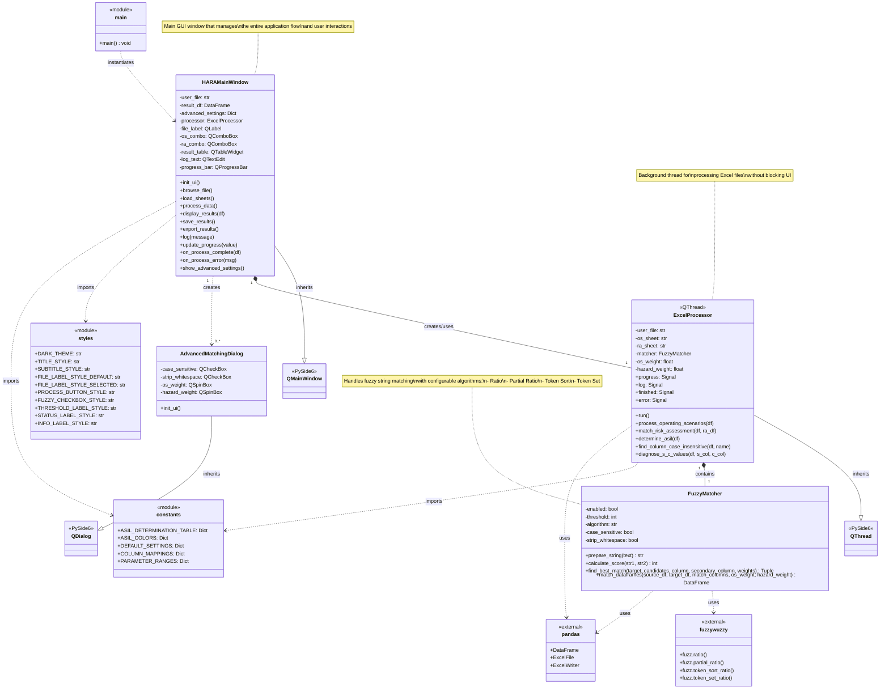

# HARA Automation Tool

A professional automation tool for **Hazard Analysis and Risk Assessment (HARA)** with automated **ASIL (Automotive Safety Integrity Level)** determination according to ISO 26262 standards.

[](https://github.com/jayanthmani8045/hara-tool/blob/main/preview/Success_Execution_Image.png)

## UML



## Features

- **Automated ASIL Determination**: Built-in ISO 26262 ASIL determination table
- **Fuzzy Matching**: Advanced string matching algorithms for scenario matching
- **Excel Integration**: Direct processing of Excel HARA sheets
- **Professional UI**: Modern dark theme with intuitive controls
- **Real-time Processing**: Background processing with progress tracking
- **Flexible Matching**: Multiple fuzzy matching algorithms (Ratio, Partial, Token Sort, Token Set)
- **Export Options**: Save results to original file or export to new file

## Installation

### Prerequisites
- Python 3.8 or higher
- pip package manager

### Install from source

1. Clone the repository:
```bash
git clone https://github.com/jayanthmani8045/hara-tool.git
cd hara-tool
```

2. Install dependencies:
```bash
pip install -r requirements.txt
```

3. Run the application:
```bash
python -m hara_tool.main
```

### Install as package

```bash
pip install .
```

Then run:
```bash
hara-tool
```

## Usage

### 1. File Selection
- Click **Browse** to select your Excel file containing HARA data
- Select the **Operating Scenario** sheet from the dropdown
- Select the **Risk Assessment** sheet from the dropdown

### 2. Configure Matching Settings
- **Enable Fuzzy Matching**: Toggle fuzzy matching on/off
- **Threshold**: Set minimum match score (50-100%)
- **Algorithm**: Choose matching algorithm:
  - **Ratio**: Simple string similarity
  - **Partial Ratio**: Matches substrings
  - **Token Sort Ratio**: Ignores word order
  - **Token Set Ratio**: Ignores duplicates and order
- **Advanced**: Configure case sensitivity and weights

### 3. Process HARA
- Click **Process HARA** to start processing
- Monitor progress in the progress bar
- View results in the Results tab
- Check processing details in the Log tab

### 4. Export Results
- **Save to Excel**: Add RESULT sheet to original file
- **Export New File**: Create a new Excel file with results

## Excel Sheet Format

### Operating Scenario Sheet
Required columns:
- `Operating Scenario`: Description of the operating scenario
- `E` (optional): Exposure value (1-4), defaults to 4
- `Hazard` columns (optional): Associated hazards

### Risk Assessment Sheet
Required columns:
- `Operating Scenario`: Must match scenarios from OS sheet
- `Hazard`: Hazard description
- `S`: Severity value (0-3)
- `C`: Controllability value (0-3)

Optional columns:
- `Hazardous Event`: Description of hazardous event
- `Details of Hazardous Event`: Additional details
- `People at Risk`: Affected persons
- `Δv`: Delta velocity
- `Severity Rationale`: Justification for S value
- `Controllability Rationale`: Justification for C value

## ASIL Determination Table

The tool uses the standard ISO 26262 ASIL determination table:

| S/E | E1 | E2 | E3 | E4 |
|-----|----|----|----|----|
| **S1** | | | | |
| C0 | QM | QM | QM | QM |
| C1 | QM | QM | QM | QM |
| C2 | QM | QM | QM | A |
| C3 | QM | QM | A | B |
| **S2** | | | | |
| C0 | QM | QM | QM | A |
| C1 | QM | QM | QM | A |
| C2 | QM | QM | A | B |
| C3 | QM | A | B | C |
| **S3** | | | | |
| C0 | QM | QM | A | B |
| C1 | QM | QM | A | B |
| C2 | A | B | B | C |
| C3 | B | C | C | D |

## Development

### Project Structure
```
hara_tool/
├── __init__.py          # Package initialization
├── main.py              # Entry point
├── gui.py               # Main window and dialogs
├── processor.py         # Excel processing logic
├── matcher.py           # Fuzzy matching logic
├── constants.py         # ASIL table and constants
└── styles.py            # UI styling
```

### Building Executable

To create a standalone executable:

```bash
pip install pyinstaller
pyinstaller --onefile --windowed --icon=resources/icon.ico hara_tool/main.py
```

## Authors

- SafeLinkInnovations team and Jayanth Mani

## Acknowledgments

- ISO 26262 standard for ASIL determination methodology
- FuzzyWuzzy library for string matching algorithms
